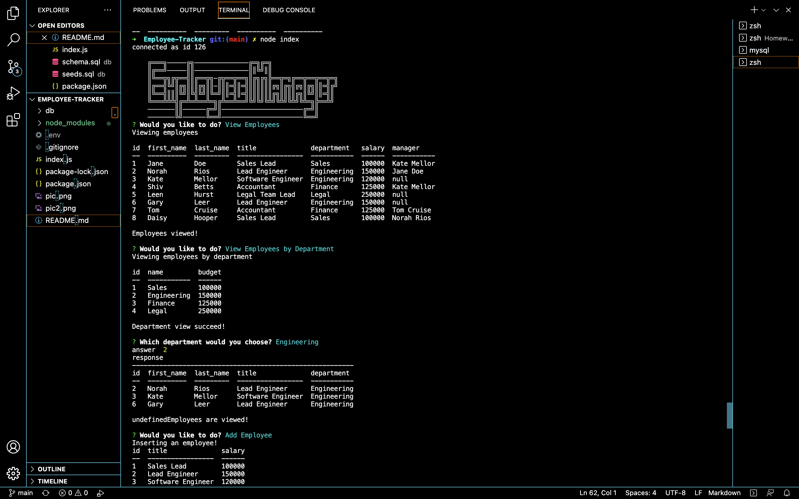
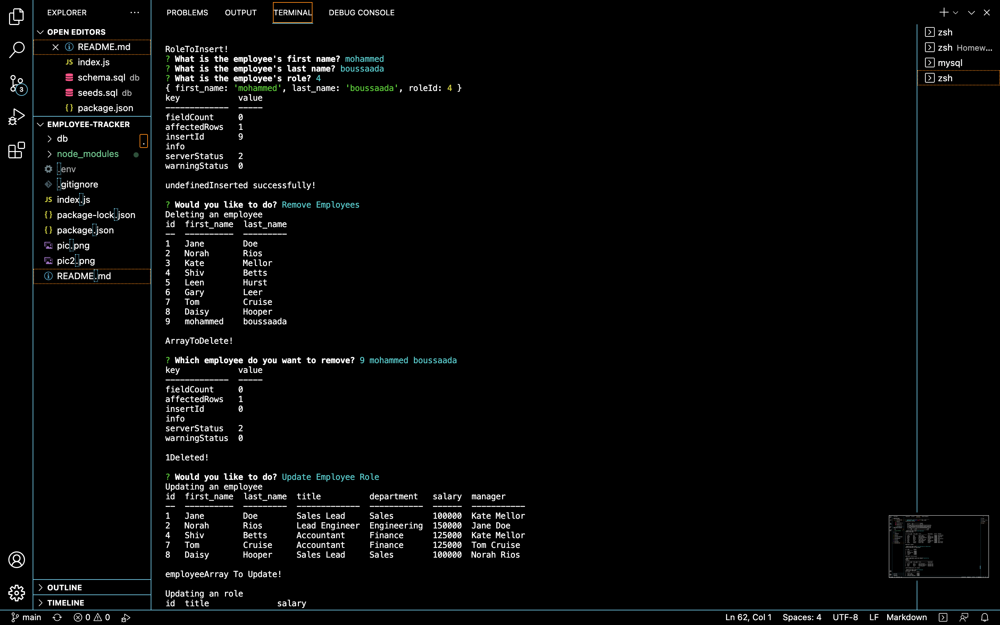
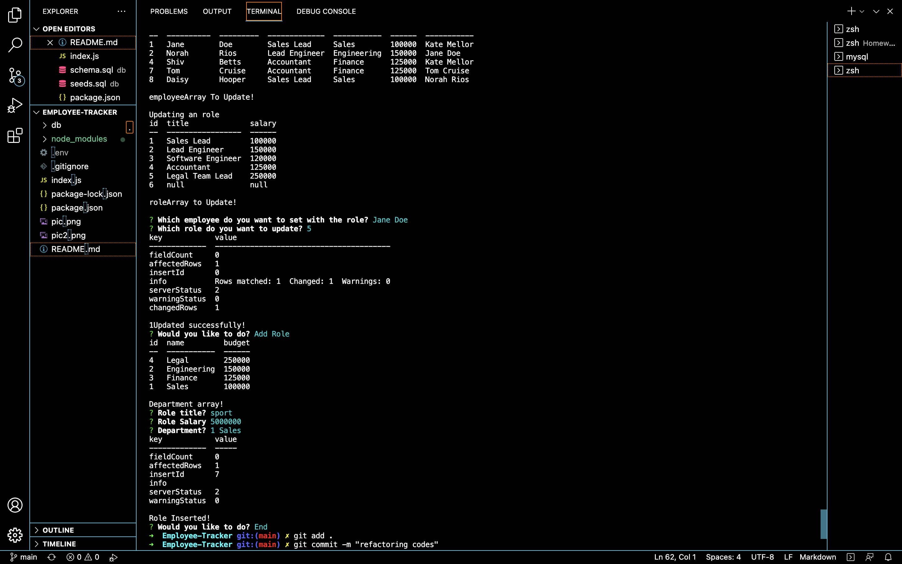

# Unit 12 MySQL Homework: Employee Tracker

## Description 

Developers are often tasked with creating interfaces that make it easy for non-developers to view and interact with information stored in databases. Often these interfaces are known as Content Management Systems. In this homework assignment, your challenge is to architect and build a solution for managing a company's employees using node, inquirer, and MySQL.

### App working example

  
[Video Link App Working](https://drive.google.com/file/d/16JUN2I-RTrpm27yqwN9kSBm2GpV8TpVb/view)

### App Screen Shots

   

## Table of contents

- [Description](#Description)
- [App Working Example](#Description)
- [Installation](#Installation)
- [Usage](#Usage)
- [Licence](#Licence)
- [Repository Link](#Repository)
- [GitHub Info](#GitHub) 

## Installation
Run:

                npm i

## Usage

This command-line application allows the user to:

  * Add departments, roles, employees

  * View departments, roles, employees

  * Update employee roles

 

  * Delete departments, roles, and employees

The application will be invoked with the following command:

                node app.js

## Licence

## Repository

- [Project Repo](https://github.com/mohamed0228/Employee-Tracker)

## GitHub

- mohammed boussaada
- [GitHub Profile](https://github.com/mohamed0228)